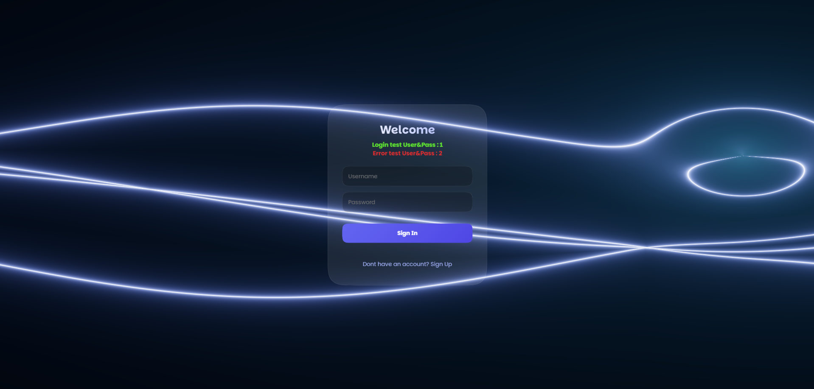

# 🔐 Immersive 3D Auth System

An experimental 3D authentication interface built with **Next.js** and **Three.js (WebGPU)**.

🔗 **[Live Demo](https://mr3dweb.github.io/immersive-auth-system/)**

## About

Tired of boring login forms — so I built one you can actually *feel*.
This project is purely a **UI/UX** experiment, no backend involved.

> The dashboard is just a mock-up to show off the post-login transition.

## ✨ Features

- **WebGPU Renderer** — next-gen performance via Three.js's experimental `WebGPURenderer`
- **Procedural Shader** — written in TSL, reacts to mouse movement and auth states
- **Smooth Transitions** — seamless came moves between Login, Sign Up & Dashboard
- **Reactive Feedback** — instant visuals for loading, error, and success states

## 🛠️ Tech Stack

| Tool | Role |
|---|---|
| **Next.js 15** | Project structure + static export |
| **TypeScript** | Type safety throughout |
| **Three.js + R3F** | 3D scene, declaative React style |
| **TSL** | WebGPU-compatible shader nodes |
| **GSAP** | Camera & uniform